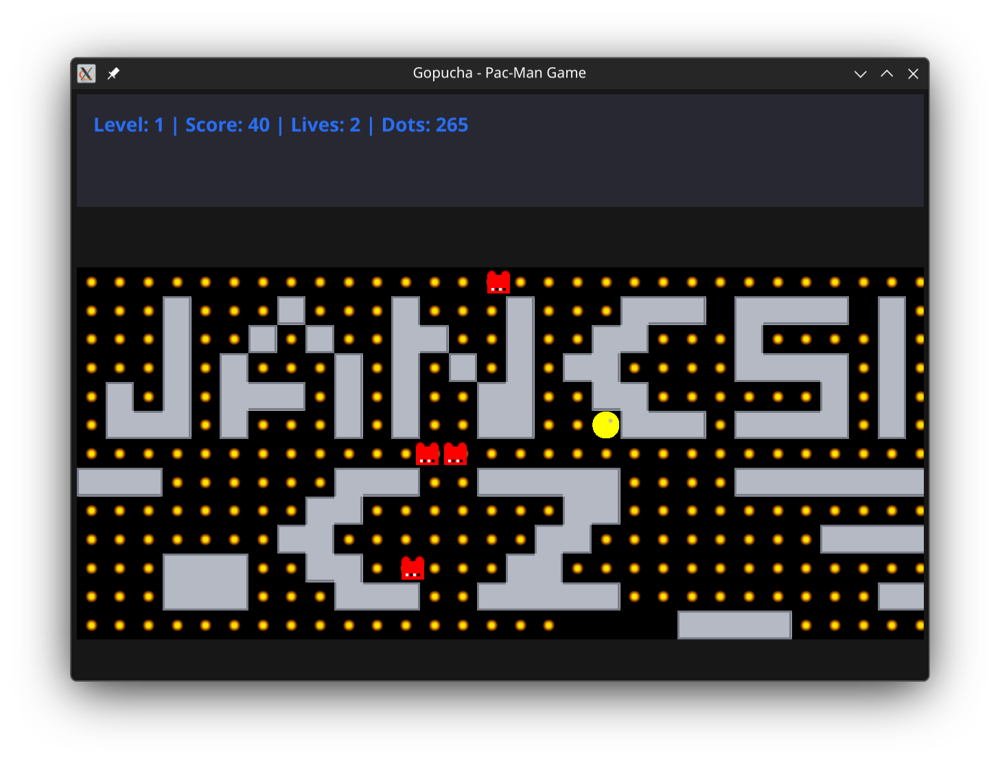

# Gopucha

Golang version of Pampuch reimplemented with custom maps.

## Screenshots

<table>
  <tr>
    <td></td>
    <td></td>
    <td></td>
  </tr>
</table>

## Description

`Ropucha` is Czech word for `toad`, and `Pampuch` is an **old Czech game** similar to `Pacman` but **more complex** in monster movement logic. Therefore the project is named `Gopucha` as a playful combination of `Go`, `Pampuch` and `Ropucha`.

The player **controls a figure** (`Pampuch`) that must eat dots while avoiding monsters.

The monsters **can only change direction when they crash to walls or themselves** and then choose the direction according to the shortest available path toward the `Pampuch` figure, making them more `thinking` challenge than traditional `Pacman` ghosts.

## Features

- **GUI Mode**: Fyne-based interface
- **Custom Map Loading**: Load maps from TXT map files
- **Level Metadata**: Per-level name, material, monster count, and speed modifier
- **GUI Features**:
  - Settings dialog (speed + map selection)
  - Arrow key movement with input buffering
  - Zoom in/out with +/- keys
  - Visual wall materials and a border that matches the current level
- **Monsters**: Count and starts based on map data; movement is a simple chase heuristic
- **Score & Lives**: Collect dots for points and avoid monsters

## Map Format

Maps are defined in TXT files using the following characters:
- `O`, `o`, or `0`: Walls
- `-`: Dot (collectible)
- `P`: Player start
- `M`: Monster start
- Space or any other character: Empty space

**Important**: All levels in a single file must have the same dimensions (width x height). Different sizes will result in an error.

Multiple levels can be defined in a single file, separated by a line containing only `---`.

### Metadata

Optional metadata lines can appear before the grid:

- `name`: Level name shown in the status bar
- `material`: Wall material (`classic`, `bricks`, `graybricks`, `purpledots`, etc.)
- `playerStart`: `x,y` player start position
- `monsterStart` / `monsterStarts`: `x,y` or `x1,y1; x2,y2` monster starts
- `monsters`: Monster count (ignored if explicit monster starts are given)
- `speedModifier`: Multiplier for movement speed (0.5 to 2.0)

### Example Map

```
OOOOOOOOOOOOOOOOOOOOOOOO
O----------------------O
O--OOO-----OOO-----OOO-O
O----------------------O
O-----OOO--OOO--OOO----O
O----------------------O
OOOOOOOOOOOOOOOOOOOOOOOO
---
OOOOOOOOOOOOOOOOOOOOOOOO
O----------------------O
O--OOO--OOO--OOO--OOO--O
O----------------------O
O--OOO--OOO--OOO--OOO--O
OOOOOOOOOOOOOOOOOOOOOOOO
```

## Installation

### Dependencies
- **Go**: Install Go 1.26+ and ensure `go` is on your PATH. Builds are done directly with Go (no Docker).
- **System libs for GUI mode** (Linux):
  - Ubuntu/Debian: `sudo apt-get install libgl1-mesa-dev xorg-dev`
  - Fedora: `sudo dnf install mesa-libGL-devel libXcursor-devel libXrandr-devel libXinerama-devel libXi-devel libXxf86vm-devel`
  - Arch: `sudo pacman -S mesa libxcursor libxrandr libxinerama libxi`

### Build (Makefile - preferred)
```bash
make build           # Standard build (GUI mode)
make build-optimized # Optimized build with size reduction
make test            # Run unit tests
```

### Run
```bash
make run             # Build and run with default map
./gopucha            # Run manually (default maps)
./gopucha maps/maps.txt
```

### Build (manual)
```bash
go build -o gopucha ./cmd/gopucha
```

## Usage

### GUI
GUI is made with Fyne and is the default mode.

Run with default maps:
```bash
./gopucha
```

Run with a specific map file:
```bash
./gopucha maps/maps.txt
./gopucha simple.txt  # Automatically looks in maps/ directory
```

GUI mode features:
- Settings dialog (ESC)
- Speed slider
- Map file selector
- Visual wall materials and border
- Zoom controls (+/-)

## Controls

### GUI Mode
- `Arrow Keys`: Move player
- `+/-`: Zoom in/out
- `ESC`: Open settings
- `F2`: Restart

## Gameplay

- Collect all dots to advance to the next level
- Avoid the monsters (red squares)
- Monsters choose a direction when blocked, preferring the axis with the larger distance to the player
- Game ends when you collide with a monster
- Win by completing all levels

## Example Maps

Example maps are included in the `maps/` directory:
- `maps/maps.txt`: Multiple levels with different materials

By default, the game loads `maps/maps.txt`. You can specify just the filename (e.g., `simple.txt`) and the game will automatically look in the `maps/` directory.

## Project Structure

```
gopucha/
├── cmd/gopucha/    # Main game executable
├── internal/       # Game logic and GUI
├── maps/           # Example map files
└── Makefile        # Build automation
```

